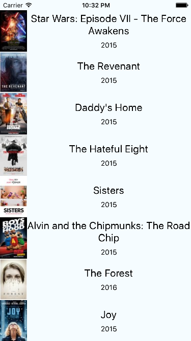

#React-Native 学习记录

纪录我自己学习和摸索React－Native的相关笔记，当然也会有一些坑，希望大家多多交流，我的邮箱：<mailto:zy@zybug.com>,相关的教程纪录，请查看[我的博客React-Native专栏](http://www.zybug.com/blog/?cat=22)
------
###项目运行说明： 请在项目根目录下运行 npm install 等待完成，即可使用Xcode打开工程运行。
####特别说明：如果运行项目出现下面类似的错误，
```
Ensure the following:
- Node server is running and available on the same network - run 'npm start' from react-native root
- Node server URL is correctly set in AppDelegate
```
###请在项目根目录下使用终端运行 npm start
----
* 1、 2016年01月14号晚上，今天上传第一个Demo，这个是官方的示例Demo。
 	